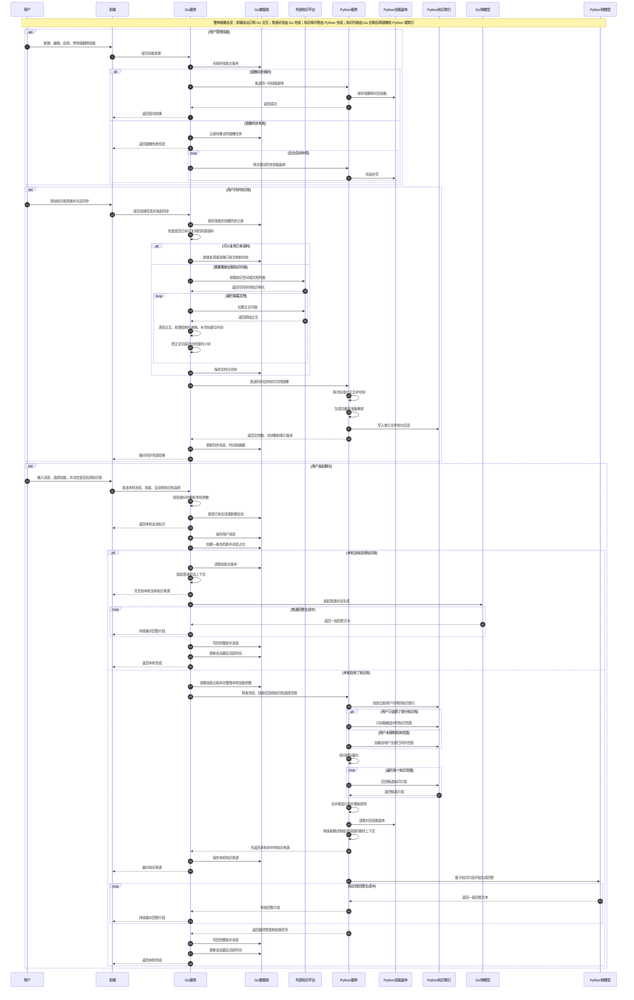

# QuickQue Go 网关 + Python RAG 双栈架构说明

## 背景与目标

QuickQue 当前采用前端不变、后端双栈协作的方式演进：

- 前端继续只和 Go 服务交互。
- Go 作为统一外部网关，负责用户态系统能力，例如认证、会话、消息、skills 主存储、知识库连接和同步任务。
- Python 作为知识侧服务，负责知识索引、检索、重排和基于知识片段的回答生成。

这套拆分的核心目标有两个：

1. 普通对话保留在 Go 内部，方便后续继续接入 agent API 或其他通用能力。
2. 知识库问答统一交给 Python，复用更完整的 RAG 流水线。

一句话概括当前设计：

> 普通对话走 Go，知识库问答走 Python，前端永远只连 Go。

## 当前架构

### 角色分工

当前系统里有六类关键角色：

- 前端：Expo App，负责消息输入、会话展示、skills 选择、知识库选择、流式展示回答。
- Go 服务：统一外部入口，负责认证、会话、消息落库、skills 主存储、知识库连接管理、同步任务、普通对话，以及对 Python 的转发。
- Go 数据库：保存用户、会话、消息、skills、知识库连接、同步任务、本地知识文档和 chunk。
- Python 服务：负责 skill 镜像、知识索引、知识检索、重排和知识库回答。
- 外部知识平台：当前主要是语雀，是真实知识内容来源。
- 模型服务：普通对话由 Go 调用；知识库问答由 Python 调用。

### 全局时序图

下面这张图把当前系统的四条主链路放在了一张图里：

- skills 管理
- 知识库同步
- 普通对话
- 知识库问答

### 前端如何组织聊天请求

前端每次发送消息时，都会把“这轮聊天的上下文”打包给 Go。当前实际会带上的关键信息有：

- `message`：用户输入的文本。
- `skill`：当前选中的回答模式，值是 `answer`、`summary`、`actions` 之一。
- `skillId`：如果选中了某个具体 skill，而不是默认的通用聊天，会带上 skill 的 UUID。
- `skillPrompt`：当前 skill 的自定义提示词。
- `useKnowledge`：是否启用知识库。
- `connectionIds`：如果用户只勾选了部分知识库，会带上这些连接 ID。
- `sessionId`：如果当前是在旧会话里继续聊天，会带上现有会话 ID。

这里有一个很重要的约定：

- `knowledgeMode = none` 时，前端会把 `useKnowledge` 设为 `false`。
- `knowledgeMode = all` 时，前端会把 `useKnowledge` 设为 `true`，但不带具体 `connectionIds`。
- `knowledgeMode = selected` 时，前端会把 `useKnowledge` 设为 `true`，并带上被选中的 `connectionIds`。

这直接决定了 Go 是否需要把请求转给 Python。

### 普通对话链路

普通对话是指：

- 用户没有开启知识库；或者
- 只是选择了某个 skill，但没有开启知识库。

这条链路完全由 Go 内部完成，Python 不参与。

具体过程是：

1. 前端把消息和当前 skill 上下文发给 Go。
2. Go 完成身份校验。
3. Go 根据 `skillId` 从自己的 skill 主库读取 skill，并确定这轮最终的 `mode` 和 `prompt`。
4. Go 找到已有会话，或者创建新会话。
5. Go 先保存用户消息，再创建一条空的助手消息占位。
6. Go 把消息、技能模式和自定义提示词整理成普通对话上下文。
7. Go 自己调用普通聊天模型。
8. 模型流式返回文本，Go 再把回答片段持续回给前端。
9. 回答结束后，Go 保存最终助手消息并更新会话。

因此，下面两种情况都不会经过 Python：

- 前端只选了 skill
- 前端进行普通对话

### 知识库问答链路

知识库问答的触发条件只有一个：

> `useKnowledge = true`

一旦启用知识库，当前主路径就是 Go 转给 Python 做知识检索和回答。

具体过程是：

1. 前端把消息、会话信息、knowledge 开关、选中的知识库范围、skill 上下文一起交给 Go。
2. Go 先完成用户校验、会话查找/创建、消息落库。
3. Go 根据 `skillId` 从本地 skill 主库取出 skill，得到本轮实际使用的模式和提示词。
4. Go 把下列信息转给 Python：
   - 谁在问
   - 问了什么
   - 是否限制知识库范围
   - 当前用哪条 skill
   - 这条 skill 的提示词
   - 当前回答模式
5. Python 根据 `connectionIds` 决定检索范围：
   - 如果传了 `connectionIds`，只查这些知识库对应的本地索引。
   - 如果没传，默认查当前用户所有已经同步过的知识库索引。
6. Python 先做召回，再做 rerank，得到最终知识片段。
7. Python 再从自己的 skill 镜像里读取同一条 skill，并结合请求里带来的 mode/prompt，组装最终提示词。
8. Python 把“命中的知识来源”先回给 Go。
9. Go 保存这些来源，并转给前端展示。
10. Python 开始流式生成回答，Go 持续转发给前端。
11. 回答结束后，Go 仍然负责保存最终助手消息和会话状态。

这里要强调两个工程判断：

- 前端并不会直接告诉 Python“正文是什么”，它只会把选中的知识库 ID 告诉 Go。
- Python 也不会在问答当场去外部知识平台拉正文，而是只读取自己本地已经同步好的索引。

### 当前存在的 Go 本地兜底路径

虽然目标行为是“知识库问答走 Python”，但当前 Go 代码里仍然保留了一条本地兜底路径：

- 如果这轮启用了知识库，但 Python forward client 没有配置成功；
- 或者当前环境没有可用的 Python 转发配置；
- Go 会退回到自己的本地 lexical search，再结合本地模型完成回答。

因此，当前代码的真实状态是：

- 标准知识库链路：Go -> Python
- 兜底知识库链路：Go 本地检索 + Go 本地回答

这条兜底路径目前仍然有价值，因为它能支持本地调试和 Python 服务不可用时的退路；但它不是长期目标架构的主路径。

### 知识库同步链路

当前知识库同步仍然由 Go 主导完成，Python 负责接收镜像后的文档并建立索引。

具体过程是：

1. 用户在前端新增知识库连接，连接信息先保存在 Go。
2. 用户点击同步后，Go 先创建一条同步任务记录。
3. Go 会先检查是否存在“等价连接”：
   - 同一用户
   - 同一 provider
   - 同一个 token
   - 同一个 group/namespace
4. 如果找到可复用语料，Go 会优先复用现有文档和 chunk，避免重复抓取外部平台。
5. 如果没有可复用结果，Go 才真正开始抓外部知识内容：
   - 列出知识库或仓库
   - 遍历文档列表
   - 拉取每篇正文
6. Go 对正文做标准化处理：
   - 清理 HTML 和噪音内容
   - 解析结构化表格，例如 `laketable`
   - 补充标题、知识库名、更新时间等上下文信息
   - 按配置切成 chunk
7. Go 把文档和 chunk 都落到自己的数据库。
8. 然后 Go 再把一份镜像后的文档列表发送给 Python。
9. Python 收到后，再做一轮标准化、切块、embedding 和索引写入。
10. Python 返回索引统计结果给 Go，Go 更新同步任务摘要和连接状态。

因此，当前同步链路的真实状态是：

- Go 负责真正拉取外部知识源
- Go 本地保存正文和 chunk
- Python 再接收镜像文档并建立知识索引

这也是当前知识库会“双份存储”的直接原因。

## 当前数据与职责边界

### skills 的主从关系

当前 skills 采用“Go 主存储 + Python 镜像副本”的结构。

职责边界如下：

- 前端只会通过 Go 修改 skill。
- Go 是 skill 的唯一权威源。
- Python 只保存一份镜像副本，供知识库问答路径使用。
- 普通对话读取 Go 主库里的 skill。
- 知识库问答读取 Python 镜像里的 skill。

这意味着 skill 虽然是双存，但不是双主。

### 为什么 skills 不会演变成双主冲突

skills 不会出现双主冲突，原因很简单：

1. 用户没有直接写 Python skill 的入口。
2. 前端所有 skill 的增删改启停都先写 Go。
3. Go 成功写入后，再把同一份 skill 镜像给 Python。
4. 如果镜像失败，Go 会记录重试任务，而不是让两边静默漂移。

也就是说，双份 skill 的语义是：

- Go：主版本
- Python：执行知识库问答时的副本

而不是：

- Go 和 Python 各自独立维护一份用户可编辑的数据

### 知识库为什么会双份存储

当前知识库双份存储是事实，而且是明显的空间开销来源。

当前 Go 侧保存：

- 知识库连接信息
- 同步任务记录
- 文档元数据
- 标准化后的正文
- 本地 chunk

当前 Python 侧保存：

- 镜像后的知识文档摘要信息
- 再处理后的 chunk
- embedding / rerank 所需材料
- 各连接对应的向量索引和索引元信息

双份存储现在之所以还能成立，是因为：

- Go 需要本地文档和 chunk 来支持本地 lexical search 兜底；
- Go 还需要本地文档数据来支撑前端知识库列表和详情页；
- Python 需要自己的索引数据来做 RAG。

但这套结构也带来三个问题：

1. 正文和 chunk 被存了两次，空间开销明显。
2. Go 和 Python 都在做知识内容处理，职责重复。
3. 后续如果两边预处理逻辑继续演进，结果可能慢慢漂移。

## 当前实现与目标实现的差异

当前实现与目标方案最大的差异，在同步链路上：

### 当前实现

- Go 拉知识源
- Go 本地存正文和 chunk
- Go 把文档镜像给 Python
- Python 建索引并负责知识问答

### 目标实现

- Go 发起同步任务，但不再自己拉正文
- Python 直接拉外部知识源
- Python 完成正文处理、切块、embedding、索引
- Python 把文档元数据和统计结果回传给 Go
- Go 只保留连接信息、同步记录和文档元数据

这两种实现的本质差异是：

- 当前实现是“Go 拉取 + Go 存正文 + Python 建索引”
- 目标实现是“Go 管理任务 + Python 拉取并建索引 + Go 只存元数据”

## 目标架构

目标架构下，系统职责边界会更清晰。

### Go 的目标职责

Go 只保留以下职责：

- 外部统一 API 网关
- 用户认证
- 会话与消息持久化
- skills 主存储
- 知识库连接信息
- 同步任务记录
- 文档元数据展示接口
- 普通对话生成
- 向 Python 发起知识同步和知识问答转发

### Python 的目标职责

Python 只保留知识侧职责：

- 直接拉取外部知识源
- 正文清洗与结构化处理
- chunk 切分
- embedding / rerank
- 向量索引写入与读取
- 按用户和连接范围检索知识
- 读取 skill 镜像
- 知识库问答生成

### 目标同步方式

目标链路下，知识库同步应该变成：

1. 前端仍然只触发 Go 的同步入口。
2. Go 创建同步任务，并把连接参数发给 Python。
3. Python 直接根据连接参数去外部知识平台拉内容。
4. Python 完成正文标准化、切块、索引写入。
5. Python 把文档元数据和统计结果回给 Go。
6. Go 只保存：
   - 连接信息
   - 同步任务记录
   - 文档元数据
7. 前端知识库列表和详情页仍然从 Go 读取。

这样可以同时满足两个目标：

- 前端不变
- Go 不再重复存正文和 chunk

## 迁移计划

下面的迁移计划按“先统一职责，再压缩存储”的顺序设计。

### 阶段 1：Python 增加“按连接参数同步知识源”的能力

目标：

- 让 Python 不再只会接收 Go 镜像过来的文档；
- 而是能直接根据连接信息去拉外部知识源。

影响：

- Python 新增内部同步能力。
- 当前问答链路不需要改。

回退点：

- 即使这一步失败，Go 仍然可以继续使用当前“自己抓正文”的旧同步路径。

### 阶段 2：Go 同步流程改为调用 Python

目标：

- Go 不再自己抓正文。
- Go 改成发起同步任务并调用 Python 的内部同步能力。

影响：

- 同步主路径从“Go 拉正文”切换成“Python 拉正文”。
- 现有前端无需改动。

回退点：

- 旧 Go 同步实现可以暂时保留为回退路径。

### 阶段 3：Go 增加 metadata-only 存储并切换前端查询

目标：

- Go 开始只存文档元数据，不再依赖正文和 chunk 来支撑前端展示。

影响：

- 前端知识库详情页和文档列表页仍然查 Go；
- 但底层数据来源从“正文库”过渡到“元数据表”。

回退点：

- 新 metadata-only 存储可以先与旧正文存储并行存在，降低切换风险。

### 阶段 4：停止 Go 写正文和 chunk

目标：

- 真正消除知识库双份正文存储。

影响：

- Go 不再写本地文档正文和 chunk。
- Python 成为唯一知识正文和索引持有方。

回退点：

- 在正式停写前，可保留一段观察期，确认 Python 同步和检索稳定。

### 阶段 5：清理旧正文表和本地 lexical search 主路径

目标：

- 清理旧的存储和检索冗余。

影响：

- Go 的本地 lexical search 退化为调试能力或被彻底退休。
- 旧知识正文/chunk 表可以逐步删除。

回退点：

- 在清理前可以先把旧逻辑仅降级为调试兜底，观察无误后再删除。

## 风险与约束

当前系统有几项需要明确记录的工程约束。

### Python 运行环境仍需整理

当前复制过来的 Python `venv` 仍然残留旧路径，不能作为稳定运行环境直接使用。实际落地时需要在 `quickque-agent/llm` 下重建虚拟环境，并重新安装依赖。

此外，Python 现在虽然提供了 `.env.example`，但默认不会自动加载 `.env` 文件，仍然需要通过 `export` 或手动注入环境变量启动。

### Go 侧仍然保留遗留未使用配置

Go 侧当前仍然读取：

- `QQA_OPENAI_EMBEDDING_MODEL`
- `QQA_RERANK_MODEL`

但这两个配置目前并没有进入实际运行主链路。它们属于遗留配置，容易让人误判“Go 仍然负责 embedding / rerank”。当前真实的 embedding / rerank 主链路在 Python。

### 当前知识库同步主路径仍然在 Go

虽然目标方案已经明确，但当前代码仍是：

- Go 抓知识源
- Go 存正文和 chunk
- Go 镜像给 Python

这意味着目标架构尚未完成切换。阅读和实现时必须明确区分：

- 当前代码真相
- 目标迁移方向

### Python legacy `/chat` 仍然存在，但不是正式链路

Python 目前仍保留了旧的 `/chat` 和 `/chat/stream` 调试接口，它们主要服务于旧 demo 或本地调试场景。

当前 QuickQue 正式链路依赖的是 Python 的 `/internal/*` 能力，而不是这些 legacy 对外接口。

## 配置分层说明

当前配置应按职责分层理解。

### Go 负责的配置

Go 负责：

- 普通聊天模型配置
- Go 自己的服务监听
- 数据库和队列
- Python 转发配置

其中最关键的几类是：

- Go 自己调用普通模型所需的 base URL、API key、chat model
- Go 转发到 Python 所需的 base URL、用户名密码或 token

### Python 负责的配置

Python 负责：

- RAG 使用的 embedding / rerank 模型
- Python 自己的问答模型
- 索引和模型缓存策略
- 知识库来源调试配置

Python 现在优先读取带 `PY_` 前缀的环境变量，目的是避免和 Go 侧同名配置混用。

## 给工程接手者的四条判断规则

下面四条规则可以快速判断这轮请求会走哪条链路：

1. 只选知识库：前端 -> Go -> Python
2. 选 skill + 知识库：前端 -> Go -> Python
3. 只选 skill：前端 -> Go
4. 普通对话：前端 -> Go

真正的分流条件只有一个：

> 是否启用了知识库

- `useKnowledge = false`：只走 Go
- `useKnowledge = true`：优先走 Python；如果 Python 不可用，当前代码仍允许 Go 本地兜底

## 术语表

- `connection`：一条知识库连接配置，表示某个用户绑定的一份外部知识来源。
- `skill`：一条可复用的回答行为配置，包含模式、提示词、描述等。
- `session`：一段聊天会话，用来串联多轮消息。
- `sync job`：一次知识库同步任务，记录同步状态、时间和摘要。
- `knowledge metadata`：前端展示知识库列表和详情所需的轻量文档信息，例如标题、来源仓库、链接和更新时间。
- `mirrored skill`：由 Go 主存储同步给 Python 的 skill 副本，仅用于知识库问答路径。

## 阅读建议

如果你是第一次接手这套系统，建议按下面顺序理解：

1. 先理解“前端永远只连 Go”这个总前提。
2. 再理解“普通对话”和“知识库问答”为什么拆成两条链路。
3. 然后理解 skills 为什么采用“Go 主存储 + Python 镜像”。
4. 最后再看知识库同步当前为什么会双存，以及为什么目标方案要收敛成“Go 只存元数据、Python 持有正文和索引”。

按这个顺序看，会比直接从代码入口倒着读更容易建立正确心智模型。
