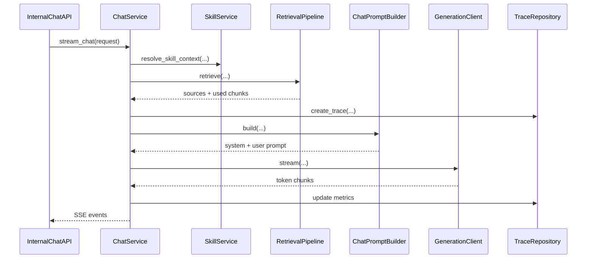
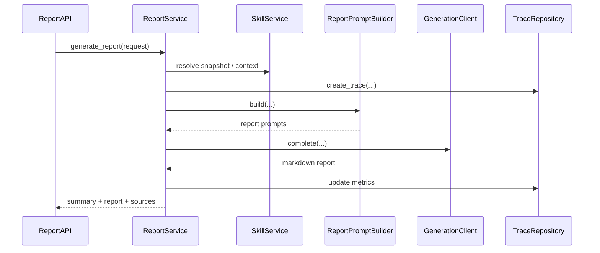

# Knowvia LLM 模块与类设计

## 1. 文档目的

本文在 [LLM 技术方案](./llm-technical-design.md) 和 [LLM 数据库与 API 设计](./llm-database-and-api-design.md) 基础上，进一步细化：

- LLM 子系统应该有哪些模块
- 每个模块的职责是什么
- 核心类与接口如何划分
- Chat 和 Report 两条链路如何在代码结构上统一

本文目标是为后续任务拆分、代码目录初始化和评审提供直接依据。

## 2. 设计原则

### 2.1 按能力域分层，不按“历史文件”分层

当前 Python 侧的典型问题是：

- `server.py` 同时承载公开接口和内部接口
- `internal_gateway.py` 同时承载文件存储、索引、检索、prompt、LLM 调用
- 模型 client 中混入业务 prompt

目标态中必须做到：

- API 只管协议
- Service 只管编排
- Retrieval 只管召回与排序
- Inference 只管模型 transport
- Prompt 只管提示词构造

### 2.2 Chat 与 Report 共用认知层

最终不能出现：

- chat 有自己的 prompt builder
- report 有另一套 report writer

正确做法是：

- 共享 retrieval pipeline
- 共享 skill resolving
- 共享 citation policy
- 共享 model gateway
- 由不同 service 使用不同 output mode

### 2.3 先定义接口，再定义实现

每个能力模块先定义接口，再实现默认版本：

- `IndexBackend`
- `EmbeddingClient`
- `RerankClient`
- `GenerationClient`
- `PromptBuilder`

这样后面可以替换实现，而不需要改 service 层。

## 3. 推荐目录结构

```text
llm/
├── qqa_llm/
│   ├── main.py
│   ├── api/
│   │   ├── internal.py
│   │   ├── health.py
│   │   └── schemas.py
│   ├── auth/
│   │   └── internal_auth.py
│   ├── core/
│   │   ├── config.py
│   │   ├── logging.py
│   │   └── errors.py
│   ├── domain/
│   │   └── models.py
│   ├── storage/
│   │   ├── db.py
│   │   ├── scope_repo.py
│   │   ├── skill_repo.py
│   │   ├── trace_repo.py
│   │   └── index_job_repo.py
│   ├── ingest/
│   │   ├── normalize.py
│   │   ├── chunk.py
│   │   └── providers/
│   │       ├── yuque.py
│   │       └── feishu.py
│   ├── index/
│   │   ├── base.py
│   │   ├── pgvector_index.py
│   │   └── noop_index.py
│   ├── retrieve/
│   │   ├── query_normalizer.py
│   │   ├── lexical.py
│   │   ├── vector.py
│   │   ├── fusion.py
│   │   ├── rerank.py
│   │   └── pipeline.py
│   ├── inference/
│   │   ├── embeddings.py
│   │   ├── reranker.py
│   │   ├── generator.py
│   │   ├── openai_client.py
│   │   └── ollama_client.py
│   ├── prompt/
│   │   ├── policy.py
│   │   ├── chat_builder.py
│   │   └── report_builder.py
│   └── services/
│       ├── scope_service.py
│       ├── skill_service.py
│       ├── indexing_service.py
│       ├── retrieval_service.py
│       ├── chat_service.py
│       └── report_service.py
└── tests/
```

## 4. 模块设计

## 4.1 `main.py`

职责：

- 创建 FastAPI app
- 注册 router
- 初始化配置与日志
- 管理依赖注入容器

建议只包含：

- `create_app()`
- app 生命周期钩子

不应该包含：

- 业务逻辑
- prompt 文本
- retrieval pipeline
- 模型实例缓存细节

## 4.2 `api/`

### `api/internal.py`

职责：

- 定义内部 API 路由
- 参数校验
- 调用 service
- 把 service 输出转成 HTTP / SSE

建议路由：

- `POST /internal/v1/index/upsert-batch`
- `DELETE /internal/v1/index/scopes/{scopeId}`
- `POST /internal/v1/retrieve`
- `POST /internal/v1/chat/stream`
- `POST /internal/v1/report/generate`
- `POST /internal/v1/skills/upsert`
- `DELETE /internal/v1/skills/{skillId}`

### `api/health.py`

职责：

- 数据库健康检查
- vector backend 健康检查
- 模型客户端就绪检查

### `api/schemas.py`

职责：

- 所有请求/响应的 Pydantic 模型
- SSE event schema
- 内部共享 DTO

不要把 schema 分散在 router 文件里。

## 4.3 `auth/`

### `internal_auth.py`

职责：

- 校验 Go -> LLM 的内部 bearer token
- 提供 FastAPI dependency

建议类与函数：

- `InternalAuthConfig`
- `InternalAuthService`
- `require_internal_client()`

明确不做：

- 用户 JWT
- 单设备登录
- 公开会话认证

## 4.4 `core/`

### `config.py`

职责：

- 统一管理配置
- 定义 Settings 对象

建议类：

- `Settings`
- `ModelProfileDefaults`

关键配置域：

- database
- internal auth
- embedding
- rerank
- generation
- timeouts
- index defaults

### `logging.py`

职责：

- 日志初始化
- trace_id 注入
- 结构化日志格式

### `errors.py`

职责：

- 定义统一领域错误

建议错误类：

- `ValidationError`
- `IndexingError`
- `RetrievalError`
- `GenerationError`
- `SkillResolveError`
- `ExternalProviderError`

## 4.5 `domain/`

### `models.py`

职责：

- 纯领域对象与枚举

建议对象：

- `ScopeRef`
- `InputDocument`
- `KnowledgeDocument`
- `KnowledgeDocumentVersion`
- `KnowledgeChunk`
- `RetrievedSource`
- `SkillContext`
- `ModelProfile`
- `ChatTrace`
- `ReportTrace`

建议枚举：

- `RequestType`
- `Provider`
- `Mode`
- `ScopeType`
- `IndexJobStatus`

要求：

- 领域对象不依赖 FastAPI
- 领域对象不依赖具体数据库 ORM

## 4.6 `storage/`

目标：

- 所有数据库读写都集中在 repository 层

### `db.py`

职责：

- 数据库连接管理
- session / transaction 辅助

建议对象：

- `Database`

### `scope_repo.py`

职责：

- 管理 `llm.index_scopes`
- 查询 scope
- 更新 scope 统计

建议类：

- `ScopeRepository`

核心方法：

- `get_by_external_id(user_id, scope_type, scope_external_id)`
- `upsert_scope(scope)`
- `update_scope_stats(scope_id, document_count, chunk_count, index_version)`
- `mark_deleted(scope_id)`

### `skill_repo.py`

职责：

- 管理 `llm.skill_mirrors`

建议类：

- `SkillMirrorRepository`

核心方法：

- `upsert_skill(skill_context)`
- `delete_skill(user_id, skill_id)`
- `get_skill(user_id, skill_id)`

### `trace_repo.py`

职责：

- 管理 request traces

建议类：

- `TraceRepository`

核心方法：

- `create_trace(trace)`
- `update_trace_metrics(trace_id, ...)`
- `mark_trace_error(trace_id, code, message)`

### `index_job_repo.py`

职责：

- 管理索引任务

建议类：

- `IndexJobRepository`

## 4.7 `ingest/`

### `normalize.py`

职责：

- 正文规范化
- HTML 去噪
- 特殊结构处理
- 表格与 lake table 文本化

建议类：

- `BodyNormalizer`
- `StructuredBodyNormalizer`
- `LakeTableNormalizer`

核心方法：

- `normalize(raw_body: str, metadata: dict) -> NormalizedDocumentBody`

这里可以复用并重构当前 `text_preprocessor` 里的结构化处理思路。

### `chunk.py`

职责：

- 根据 normalize 结果构造 chunk
- 注入标题路径、repo、更新时间等 metadata

建议类：

- `ChunkBuilder`
- `ChunkingPolicy`

核心方法：

- `build_chunks(document_version) -> list[KnowledgeChunk]`

## 4.8 `ingest/providers/`

这层只作为辅助，不是主链核心。

### `providers/yuque.py`

职责：

- 在保留 `sync-source` 过渡接口时，按 provider 参数拉取文档包

建议类：

- `YuquePayloadLoader`

### `providers/feishu.py`

职责：

- 提供 Feishu 侧文档包转换

建议类：

- `FeishuPayloadLoader`

长期目标：

- 这层越来越薄
- 由 Go 主导抓取，上游直接传 `InputDocument[]`

## 4.9 `index/`

### `base.py`

职责：

- 定义索引后端抽象接口

建议接口：

- `IndexBackend`

核心方法：

- `upsert_batch(scope, documents, versions, chunks)`
- `delete_scope(scope_id)`
- `delete_document(document_id)`
- `health_check()`

### `pgvector_index.py`

职责：

- 基于 Postgres + pgvector 的主实现

建议类：

- `PgVectorIndexBackend`

内部职责：

- chunk 写入
- embedding 列写入
- lexical tsvector 写入
- 删除与重建

### `noop_index.py`

职责：

- 测试或 dry-run 模式使用

建议类：

- `NoopIndexBackend`

## 4.10 `inference/`

### `embeddings.py`

职责：

- embedding 模型抽象

建议接口与类：

- `EmbeddingClient`
- `OpenAIEmbeddingClient`
- `BCEEmbeddingClient`

核心方法：

- `embed_texts(texts: list[str]) -> list[list[float]]`

### `reranker.py`

职责：

- rerank 模型抽象

建议接口与类：

- `RerankClient`
- `BCERerankClient`

核心方法：

- `rerank(query: str, candidates: list[str]) -> list[RerankResult]`

### `generator.py`

职责：

- 生成模型抽象

建议接口：

- `GenerationClient`

核心方法：

- `complete(system_prompt, user_prompt, profile)`
- `stream(system_prompt, user_prompt, profile)`

### `openai_client.py`

职责：

- OpenAI-compatible transport

建议类：

- `OpenAICompatibleGenerationClient`

### `ollama_client.py`

职责：

- 本地 Ollama transport

建议类：

- `OllamaGenerationClient`

要求：

- inference 层不拼业务 prompt
- inference 层不感知 skill 与 evidence

## 4.11 `retrieve/`

这是最终最关键的共享认知层。

### `query_normalizer.py`

职责：

- query 标准化
- 中英混合 token 拆分
- 中文 n-gram 生成

建议类：

- `QueryNormalizer`

### `lexical.py`

职责：

- 词法召回

建议类：

- `LexicalRetriever`

核心方法：

- `search(user_id, scope_ids, normalized_query, top_k)`

### `vector.py`

职责：

- 向量召回

建议类：

- `VectorRetriever`

### `fusion.py`

职责：

- lexical/vector 结果融合

建议类：

- `ReciprocalRankFusion`

### `rerank.py`

职责：

- 调用 rerank client 做精排

建议类：

- `RerankPipeline`

### `pipeline.py`

职责：

- 串起 retrieval 全流程

建议类：

- `RetrievalPipeline`

核心方法：

- `retrieve(query, scope_ids, top_k, trace_context) -> RetrievalResult`

建议返回：

- `sources`
- `retrieved_chunk_ids`
- `reranked_chunk_ids`
- `used_chunk_ids`
- `metrics`

## 4.12 `prompt/`

### `policy.py`

职责：

- 统一系统级规则

建议类：

- `GroundingPolicy`
- `CitationPolicy`
- `OutputPolicy`

### `chat_builder.py`

职责：

- 构造知识问答 prompt

建议类：

- `ChatPromptBuilder`

输入：

- `message`
- `skill_context`
- `retrieved_sources`
- `model_profile`

输出：

- `system_prompt`
- `user_prompt`

### `report_builder.py`

职责：

- 构造 report prompt

建议类：

- `ReportPromptBuilder`

输入：

- `goal`
- `mode`
- `skill_snapshot`
- `evidences`

输出：

- `system_prompt`
- `user_prompt`
- `expected_sections`

## 4.13 `services/`

service 层负责把各个能力模块串起来，是 LLM 子系统的业务编排层。

### `scope_service.py`

职责：

- scope 生命周期管理

建议类：

- `ScopeService`

核心方法：

- `ensure_scope(user_id, scope_ref)`
- `delete_scope(user_id, scope_id)`

### `skill_service.py`

职责：

- skill mirror 管理
- skill context 解析

建议类：

- `SkillService`

核心方法：

- `upsert_skill(request)`
- `delete_skill(user_id, skill_id)`
- `resolve_skill_context(user_id, request_skill_context)`

### `indexing_service.py`

职责：

- 索引入口总编排

建议类：

- `IndexingService`

依赖：

- `ScopeRepository`
- `IndexJobRepository`
- `BodyNormalizer`
- `ChunkBuilder`
- `IndexBackend`

核心方法：

- `upsert_batch(request) -> UpsertBatchResult`
- `delete_scope(user_id, scope_id)`

### `retrieval_service.py`

职责：

- retrieval API 的直接服务入口

建议类：

- `RetrievalService`

依赖：

- `RetrievalPipeline`
- `TraceRepository`

核心方法：

- `retrieve(request) -> RetrievalResult`

### `chat_service.py`

职责：

- grounded chat 总编排

建议类：

- `ChatService`

依赖：

- `SkillService`
- `RetrievalPipeline`
- `ChatPromptBuilder`
- `GenerationClient`
- `TraceRepository`

核心方法：

- `stream_chat(request) -> iterator[SSEEvent]`

行为：

1. 解析 skill context
2. 检索 sources
3. 写 trace
4. 先发 `retrieval`
5. 构造 prompt
6. 调生成模型并流式发 `chunk`
7. 收尾发 `done`
8. 出错发 `error`

### `report_service.py`

职责：

- run/report 输出总编排

建议类：

- `ReportService`

依赖：

- `SkillService`
- `ReportPromptBuilder`
- `GenerationClient`
- `TraceRepository`

核心方法：

- `generate_report(request) -> ReportGenerationResult`

行为：

1. 解析 skill snapshot
2. 预处理 evidences
3. 构造 report prompt
4. 调生成模型
5. 返回 `summary + report_markdown + sources + trace`

## 5. 类之间的协作关系

## 5.1 知识问答链路



## 5.2 报告生成链路



## 6. 推荐接口签名

以下是建议的 Python 级核心接口。

### `IndexBackend`

```python
class IndexBackend(Protocol):
    def upsert_batch(
        self,
        scope: ScopeRef,
        documents: list[KnowledgeDocument],
        versions: list[KnowledgeDocumentVersion],
        chunks: list[KnowledgeChunk],
    ) -> None: ...

    def delete_scope(self, user_id: str, scope_id: str) -> None: ...

    def health_check(self) -> dict[str, str]: ...
```

### `RetrievalPipeline`

```python
class RetrievalPipeline:
    def retrieve(
        self,
        *,
        user_id: str,
        query: str,
        scope_ids: list[str],
        top_k: int = 8,
        trace_id: str | None = None,
    ) -> RetrievalResult: ...
```

### `ChatService`

```python
class ChatService:
    def stream_chat(self, request: InternalChatRequest) -> Iterator[SSEEvent]: ...
```

### `ReportService`

```python
class ReportService:
    def generate_report(self, request: InternalReportRequest) -> ReportGenerationResult: ...
```

## 7. 代码所有权建议

为了避免后续模块失控，建议明确所有权：

- `api/`：接口协议与 router
- `services/`：产品认知编排
- `retrieve/`：检索算法
- `prompt/`：统一输出规则
- `inference/`：模型 transport
- `storage/`：数据读写

严禁：

- 在 `api/` 中直接写检索逻辑
- 在 `inference/` 中写业务 prompt
- 在 `storage/` 中写业务编排

## 8. 测试建议

### 单元测试

- `normalize.py`
- `chunk.py`
- `query_normalizer.py`
- `fusion.py`
- `prompt builders`

### 集成测试

- `index/upsert-batch`
- `retrieve`
- `chat/stream`
- `report/generate`

### 回归测试

- 同一组知识问答样例的 grounding 稳定性
- 同一组 report 样例的结构稳定性

## 9. 拆任务建议

可以按以下顺序拆开发任务：

1. `core + api schemas + auth`
2. `storage repos + db bootstrap`
3. `ingest normalize + chunk`
4. `index backend`
5. `retrieval pipeline`
6. `chat service`
7. `report service`
8. `health + traces + tests`

## 10. 结论

模块和类设计的核心目标，是确保 QuickQue 的 LLM 子系统不是“一个大文件里堆满检索和模型调用”，而是：

- 按认知能力拆分
- 按职责边界组织
- 同时服务 Chat 与 Report

只有这样，QuickQue 才能把知识问答和 Run 报告真正收敛成一套统一的认知系统。
