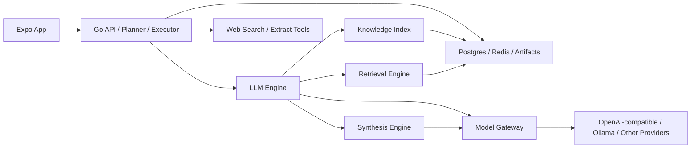

# Knowvia LLM 技术方案

## 1. 背景

Knowvia 的最终产品目标，不是做一个单独的语雀问答服务，而是做一个围绕 `run -> timeline -> artifact -> final report` 交付的研究型 Agent 产品。

当前系统已经具备这个方向的基础骨架：

- `app/` 面向 Run、时间线、报告交付，而不是传统聊天页面。
- `server/` 负责认证、Run 状态机、显式步骤执行、Artifact 存储、Source 存储和事件流。
- `run` 主链路已经是显式 research workflow：`planning -> yuque search -> web search -> page extract -> evidence merge -> report writer -> finalize`。
- 知识库问答、Run 报告生成、普通对话目前分别使用了不同的模型入口和不同的 prompt 组织方式，认知能力仍然是分散的。

这带来了三个核心问题：

1. 同一个产品里，`chat` 和 `run/report` 走的是两套认知链路。
2. 知识 grounding、引用规则、技能指令和输出结构没有统一。
3. Go 与 Python 的职责边界仍然偏“实现历史”，而不是“产品目标”驱动。

因此，需要重新定义 `llm` 的角色：它不再是一个“语雀 RAG 后端”，而是 QuickQue 的统一认知引擎。

## 2. 设计目标

### 2.1 总目标

构建一个面向 Knowvia 的内部 `LLM Engine`，统一承担以下能力：

- 内部知识的标准化、切块、索引、召回与重排
- 知识库问答的 grounded generation
- Run 流程中多源证据的 synthesis
- 最终 Markdown 报告与摘要生成
- skill/mode 驱动的输出风格调整
- source/citation/trace 的统一产出

### 2.2 设计原则

- Go 负责产品编排，LLM 负责认知与生成
- 所有高价值输出都必须以 evidence 为基础
- Chat 和 Report 共用同一套 grounding 与 citation 规则
- 内部 API 稳定，模型与索引实现可替换
- 先服务产品主链，再追求技术完整性

### 2.3 非目标

本方案明确不让 `llm` 负责以下职责：

- 用户公开登录与公开聊天 API
- 第三方知识源连接管理
- 知识源同步任务调度、重试和补偿
- Run 状态机、Artifact 主存储、Source 主存储
- 前端会话与业务权限模型

这些继续属于 Go 服务。

## 3. 最终角色定位

在最终架构中：

- Go 是 `Workflow and Product Backend`
- LLM 是 `Evidence Reasoning Engine`

Go 管理“做什么”和“流程走到哪一步”，LLM 负责“拿什么证据”和“如何组织可信输出”。

### 3.1 系统职责划分

| 组件 | 职责 |
| :--- | :--- |
| `app/` | 展示 Run、Timeline、Artifacts、Sources、Chat 结果 |
| `server/` | 认证、Run 编排、工具调用、知识连接管理、消息与 Artifact 存储 |
| `llm/` | 知识索引、检索、重排、问答生成、证据合成、报告生成 |
| `infra/` | Postgres/pgvector、Redis、对象存储等基础设施 |

### 3.2 关键判断

LLM 在 QuickQue 中要服务两条主链：

1. `Knowledge Chat`
2. `Run / Report Generation`

如果只服务第一条链，QuickQue 最终仍然会保留两套认知系统，无法形成统一产品能力。

## 4. 总体架构



### 4.1 LLM 内部分层

- `Knowledge Index`
  - 文档标准化
  - chunk 切分
  - embedding
  - lexical/vector 索引写入

- `Retrieval Engine`
  - query normalize
  - lexical recall
  - vector recall
  - fusion
  - rerank
  - source shaping

- `Synthesis Engine`
  - grounded chat
  - evidence merge
  - report drafting
  - summary extraction
  - actions generation

- `Model Gateway`
  - embedding client
  - rerank client
  - generator client
  - model profile routing
  - timeout / retry / fallback

## 5. 关键产品链路

## 5.1 知识索引链路

目标：把上游知识源内容转化为可检索、可引用、可重建的内部知识表示。

流程：

1. Go 从知识源获取文档正文并做主流程编排
2. Go 将标准化文档包发送给 LLM
3. LLM 计算 `content_hash`
4. LLM 判断新增、更新、删除
5. LLM 执行正文 normalize
6. LLM 按标题层级与段落做 chunk 切分
7. LLM 写入全文检索字段和 embedding
8. LLM 返回 `document_count/chunk_count/index_version`
9. Go 更新同步任务和连接状态

关键约束：

- Go 仍然是知识同步的编排者
- LLM 不主动成为主同步器
- LLM 只接收“已经拉好的文档包”

## 5.2 知识问答链路

目标：让启用了知识库的聊天走统一的 evidence-grounded 生成链路。

流程：

1. 前端发起消息
2. Go 解析 knowledge scope、skill snapshot、runtime config
3. Go 调用 `LLM /internal/chat/stream`
4. LLM 根据 scope 过滤可用知识
5. LLM 执行 retrieval pipeline
6. LLM 先返回命中的 sources
7. Go 保存 sources 并转发给前端
8. LLM 基于最终上下文流式生成回答
9. Go 保存 assistant message 和会话状态

目标输出：

- 流式正文
- 明确来源
- 尽量编号引用 `[1] [2]`
- 证据不足时显式说明

## 5.3 Run / Report 链路

目标：让 Run 的最终报告也走统一认知链路，而不是在 Go 内直接拼 prompt。

流程：

1. Go planner 决定 run steps
2. Go 执行 Yuque/Web/Page Extract 等证据生产步骤
3. 在 `evidence merge` 阶段，Go 可调用 LLM 做 evidence ranking / clustering
4. 在 `report writer` 阶段，Go 调用 `LLM /internal/report/generate`
5. LLM 生成：
   - summary
   - markdown report
   - citations / used sources
6. Go 保存 final answer artifact 和 report artifact

这条链路的关键是：最终交付物是 report，不是聊天文本。

## 6. 领域模型设计

## 6.1 知识模型

### `knowledge_documents`

表示逻辑文档，不直接承载检索正文。

字段建议：

- `id`
- `user_id`
- `scope_id`
- `provider`
- `external_id`
- `repo`
- `title`
- `source_url`
- `source_updated_at`
- `content_hash`
- `status`
- `latest_version_id`
- `created_at`
- `updated_at`

### `knowledge_document_versions`

表示文档版本快照，支持可追溯和重建。

字段建议：

- `id`
- `document_id`
- `normalized_body`
- `outline_json`
- `body_hash`
- `token_count`
- `created_at`

### `knowledge_chunks`

表示检索最小单位。

字段建议：

- `id`
- `document_id`
- `scope_id`
- `chunk_index`
- `heading_path`
- `content`
- `token_count`
- `lexical_text`
- `embedding vector`
- `created_at`

## 6.2 Skill 模型

### `skill_mirrors`

在 LLM 内保存运行期需要的 skill 镜像，不作为主存储。

字段建议：

- `skill_id`
- `user_id`
- `mode`
- `prompt`
- `runtime_spec_json`
- `revision_id`
- `enabled`
- `updated_at`

## 6.3 Trace 模型

### `llm_traces`

记录 retrieval 和 generation 的可观测信息。

字段建议：

- `trace_id`
- `request_type`
- `user_id`
- `scope_ids`
- `model_profile`
- `query`
- `retrieved_chunk_ids`
- `reranked_chunk_ids`
- `used_chunk_ids`
- `latency_ms`
- `output_preview`
- `error_code`
- `created_at`

## 7. 检索设计

目标不是“召回越多越好”，而是“给生成模型更少、更可信、更有覆盖度的上下文”。

### 7.1 Retrieval Pipeline

`query normalize -> lexical recall -> vector recall -> fusion -> rerank -> diversity trim -> prompt context`

### 7.2 Query Normalize

- 去噪与大小写归一
- 混合 token 拆分
- 中英文混合词拆分
- 中文 n-gram 辅助召回
- 日期、版本号、产品名保留原样

当前 Go 侧 lexical 原型里已经有中英混合 token 和 CJK n-gram 处理思路，可作为参考：[store/search.go](/Users/chenhaibin/Desktop/yuque-rag/quickque-agent/server/internal/store/search.go:9)。

### 7.3 Lexical Recall

推荐使用：

- `Postgres tsvector` 作为主实现
- 标题权重大于 repo，repo 权重大于正文

目标：

- 解决产品名、术语名、日期、短语精确匹配问题
- 解决向量召回对短 query 不稳定的问题

### 7.4 Vector Recall

推荐使用：

- `pgvector` 作为长期主实现
- ANN 查询按 `scope_id` 过滤

设计要求：

- embedding 模型和维度写入 index metadata
- 维度不匹配时必须强制重建

### 7.5 Fusion

推荐 `RRF`：

- 实现简单
- 比手工加权更稳
- 更适合 lexical/vector 混合结果

### 7.6 Rerank

规则：

- 对 fusion 后前 20 到 30 条做精排
- rerank 只排序，不负责过滤作用域
- rerank 结果必须映射回 `chunk_id`

### 7.7 Diversity 控制

规则：

- 同一文档最多保留 2 到 3 个 chunk
- 同一 repo 可做软上限，避免单库压制
- 最终上下文按 token budget 控制在 6 到 8 个 chunk

## 8. 生成设计

## 8.1 统一输出原则

无论是 chat 还是 report，都必须遵守：

- 高价值结论优先 grounded
- 证据不足时明确说明不足
- 内部知识与外部来源显式区分
- 尽量使用 `[1] [2]` 引用
- 输出支持 Markdown

## 8.2 Prompt 分层

Prompt 必须拆成 4 层：

1. `Base Policy`
   - 统一 grounding 规则
   - 禁止编造
   - 引用规则

2. `Mode Policy`
   - `answer`
   - `summary`
   - `actions`
   - `report`

3. `Skill Policy`
   - snapshot 中的 prompt
   - runtime spec 中的 instructions

4. `Context Payload`
   - 用户问题或 run goal
   - evidence 列表
   - sources 编号

不能再把业务 prompt 直接放在模型 client 里。当前 Go chat 和 Go report 各自维护 prompt，只适合作为过渡实现，不适合作为终态：[chat/service.go](/Users/chenhaibin/Desktop/yuque-rag/quickque-agent/server/internal/chat/service.go:252)、[tools/report.go](/Users/chenhaibin/Desktop/yuque-rag/quickque-agent/server/internal/tools/report.go:38)。

## 8.3 Chat 输出

输入：

- `message`
- `scope_ids`
- `skill_context`
- `runtime config`

输出：

- `sources`
- `stream chunks`
- `final answer`

## 8.4 Report 输出

输入：

- `goal`
- `effective mode`
- `evidences`
- `skill snapshot`
- `runtime config`

输出：

- `summary`
- `markdown report`
- `used sources`

Report 的固定结构建议至少包含：

- 结论摘要
- 关键发现
- 知识库依据
- 外部来源
- 建议动作

这与当前 fallback report 的结构一致，但最终应由 LLM Engine 统一生成，而不是散落在 Go 工具层：[tools/report.go](/Users/chenhaibin/Desktop/yuque-rag/quickque-agent/server/internal/tools/report.go:109)。

## 9. 内部 API 设计

## 9.1 索引 API

### `POST /internal/index/upsert-batch`

用途：

- 接收同一 scope 下的一批标准化文档
- 写入索引

请求体建议：

- `user_id`
- `scope_id`
- `provider`
- `documents[]`

返回：

- `document_count`
- `chunk_count`
- `index_version`

### `DELETE /internal/index/scope/{scope_id}`

用途：

- 删除 scope 下全部知识索引

## 9.2 检索 API

### `POST /internal/retrieve`

用途：

- 调试 retrieval pipeline
- 评估召回与 rerank

返回：

- `sources[]`
- `trace_id`

## 9.3 Chat API

### `POST /internal/chat/stream`

用途：

- 为启用知识库的聊天提供统一流式回答

请求体建议：

- `user_id`
- `message`
- `scope_ids`
- `skill_context`
- `model_profile`

SSE 事件：

- `retrieval`
- `chunk`
- `done`
- `error`

## 9.4 Report API

### `POST /internal/report/generate`

用途：

- 基于多源 evidence 生成最终 report

请求体建议：

- `goal`
- `mode`
- `evidences[]`
- `skill_snapshot`
- `model_profile`

返回：

- `summary`
- `report_markdown`
- `sources[]`
- `trace_id`

## 10. 技术实现

## 10.1 技术栈

- Python 3.11
- FastAPI
- Pydantic v2
- Postgres 17 + pgvector
- Redis 可选
- OpenAI-compatible client
- Ollama fallback

## 10.2 代码结构

建议按能力域组织：

```text
llm/
├── api/
├── core/
├── domain/
├── ingest/
├── index/
├── retrieve/
├── inference/
├── prompt/
├── services/
└── storage/
```

## 10.3 运行配置

核心配置建议包括：

- `LLM_DATABASE_URL`
- `LLM_REDIS_URL`
- `LLM_INTERNAL_TOKEN`
- `LLM_EMBEDDING_MODEL`
- `LLM_RERANK_MODEL`
- `LLM_CHAT_MODEL_DEFAULT`
- `LLM_CHAT_MODEL_REPORT`
- `LLM_CHAT_BASE_URL`
- `LLM_CHAT_API_KEY`
- `LLM_OLLAMA_BASE_URL`
- `LLM_TIMEOUT_RETRIEVE_MS`
- `LLM_TIMEOUT_GENERATE_MS`

## 10.4 模型策略

推荐拆成三类 profile：

- `chat_fast`
  - 用于知识问答
  - 目标是低延迟

- `chat_quality`
  - 用于更复杂的知识问答
  - 目标是更稳的综合回答

- `report_writer`
  - 用于 run/report
  - 目标是结构化长文输出

模型 client 只管 transport，不管业务 prompt。

## 11. 与当前系统的集成方式

## 11.1 保持 Go 为统一入口

前端仍然永远只连接 Go，不直接连接 LLM。

## 11.2 Chat 集成

当前 Go 的 `chat` 服务在启用知识库时已经能转发给 Python：[chat/service.go](/Users/chenhaibin/Desktop/yuque-rag/quickque-agent/server/internal/chat/service.go:163)。

最终目标：

- 保留这个外部行为
- 但把 Python 侧能力升级为统一 Evidence Reasoning Engine

## 11.3 Run 集成

当前 Go 在 `report writer` 步骤仍然直接调用本地 report writer：[run/service.go](/Users/chenhaibin/Desktop/yuque-rag/quickque-agent/server/internal/run/service.go:233)。

最终目标：

- `report writer` 改为调用 LLM 的 `report.generate`
- `evidence merge` 也可调用 LLM 做 ranking / synthesis

这样 Run 和 Chat 共享同一套认知规则。

## 12. 实施阶段

### Phase 1：统一知识问答引擎

- 建立 `index`、`retrieve`、`chat.stream`
- 接入 lexical + vector + rerank
- 输出统一 `sources`
- 保留 Go 为统一入口

### Phase 2：统一报告生成引擎

- 增加 `report.generate`
- Run 流程中的 `report writer` 改走 LLM
- 统一 chat/report grounding 规则

### Phase 3：工程化增强

- `pgvector` 主索引
- trace 评估体系
- model profile routing
- 异步索引任务
- schema 化输出

## 13. 风险与应对

### 风险 1：把 LLM 做成另一个“大后端”

应对：

- 严格限制职责，只做知识与认知
- 不接管认证、Run、Artifact 主存储

### 风险 2：Chat 和 Report 再次分叉

应对：

- 统一 prompt builder
- 统一 source/citation 输出
- 统一 synthesis 规则

### 风险 3：索引实现先天绑定

应对：

- 抽象 `IndexBackend`
- 开发期可用本地存储
- 生产默认 `pgvector`

### 风险 4：输出不可追溯

应对：

- 每次 retrieval/generation 都写 trace
- 保存 used chunk ids
- 保存 output preview 与 model profile

## 14. 验收标准

技术验收：

- Knowledge Chat 与 Run Report 共享统一的 LLM Engine
- Go 不需要承担 report prompt 编排
- LLM 提供稳定的 retrieval/chat/report 内部 API
- 所有输出可追溯到 sources

产品验收：

- 用户在 chat 中启用知识库时，能看到稳定来源和更可信回答
- 用户发起 run 后，最终 report 的结构、依据、建议动作更一致
- Timeline 中的 sources 与 report 中的依据能对齐

质量验收：

- retrieval latency 达标
- first token latency 达标
- hallucination 降低
- report 可用性提升

## 15. 结论

Knowvia 的 `llm` 最终不应该被定义成“语雀 RAG 服务”，而应该被定义成：

> 一个面向 QuickQue 产品主链路的内部 Evidence Reasoning Engine。

它的职责是：

- 接住 Go 编排出来的知识和证据
- 用统一的 grounding 规则完成 retrieval、synthesis、generation
- 同时服务 `Knowledge Chat` 和 `Run / Report`

只有这样，QuickQue 的最终产品目标才会真正收敛成一套认知系统，而不是“一个 Run 系统 + 一个知识聊天外挂”。

## 16. GitHub Repo Analysis 任务链路

GitHub Repo Analysis 是 Run 系统中的专用任务类型，用来处理“分析 GitHub 仓库并生成 Code Wiki Markdown 文档”这类请求。

### 16.1 交互流程

用户在任务创建页输入 GitHub 仓库地址和目标后，前端仍然调用 Go 的 `POST /v1/runs`。Go 识别 `github.com/{owner}/{repo}` URL 后：

1. 创建 `kind=github_repo_analysis` 的 Run。
2. 创建 `kind=task` 的任务会话，并通过 `run_id` 绑定 Run。
3. 生成 `task_prompt`，返回给前端。
4. 前端跳转到聊天页，选中任务会话，并自动发送 `task_prompt`。
5. 普通最近会话列表只展示 `kind=chat` 的会话，任务会话留在历史任务里。

这条链路的关键变化是：Run 不再要求用户停留在创建页等待结果，而是进入一个任务绑定的新对话继续推进。

### 16.2 Go 与 LLM 分工

Go 负责确定性工程动作：

- 识别 GitHub URL，生成任务 prompt。
- 创建 Run、任务会话、timeline step 和 artifact。
- Clone public repo 到临时目录。
- 只读扫描文件树，跳过 `.git`、`node_modules`、`dist`、二进制、大文件和敏感文件。
- 提取 README、manifest、入口文件和核心源码摘录。
- 将最终 Markdown 保存为 `code_wiki` artifact。

LLM 负责认知综合：

- 基于 Go 提供的目录树、语言信息、运行命令线索和关键文件摘录生成 Code Wiki。
- 解释整体架构、模块职责、关键类/函数、依赖关系、运行方式、测试方式和扩展点。
- 在上下文不足时明确写出限制，不编造未扫描文件的细节。

如果本地没有可用模型，Go 会生成 deterministic fallback Code Wiki，确保任务仍能产生产物。

### 16.3 数据模型

- `runs.kind`: `research` 或 `github_repo_analysis`。
- `runs.source_url`: 规范化后的 GitHub 仓库地址。
- `runs.task_session_id`: 任务会话 ID。
- `runs.task_prompt`: 前端自动发送的启动 prompt。
- `chat_sessions.kind`: `chat` 或 `task`。
- `chat_sessions.run_id`: 任务会话所属 Run。
- `run_artifacts.kind`: 新增 `code_wiki`。

### 16.4 MVP 限制

- 默认只支持 public GitHub repository。
- 只读取仓库文件，不执行仓库代码。
- 目前按关键文件摘录生成 Code Wiki，大型仓库不会一次性覆盖所有文件。
- 后续可扩展为仓库切块入库，支持任务会话中的多轮精准追问。
